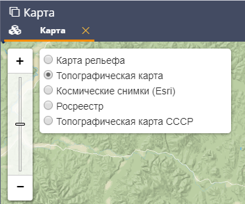
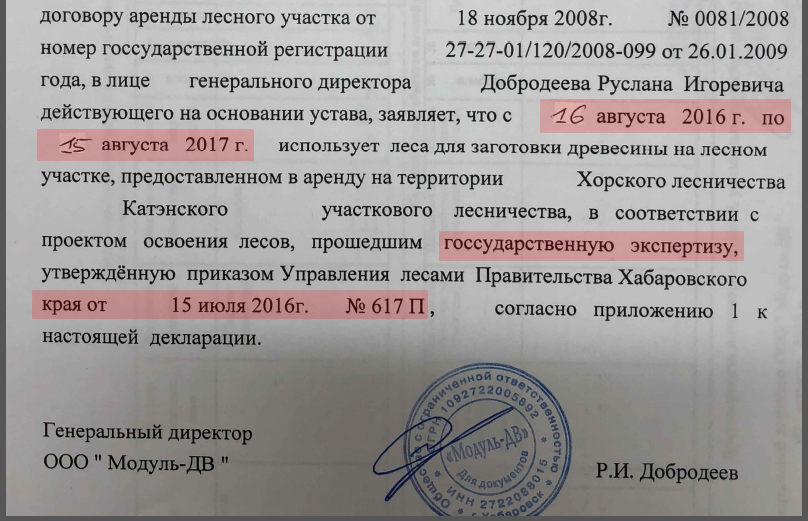
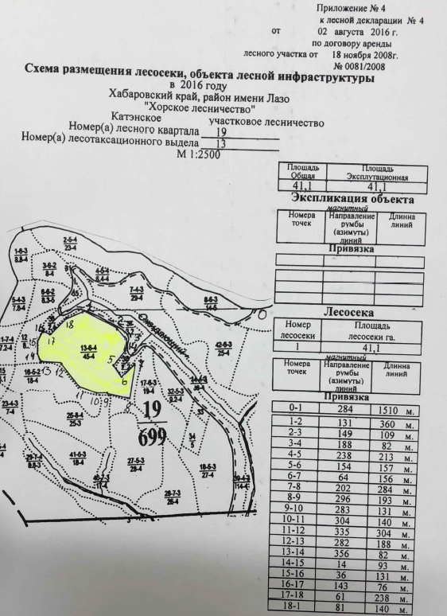
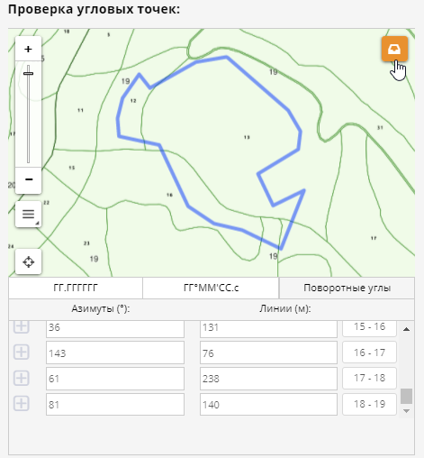
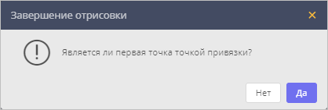
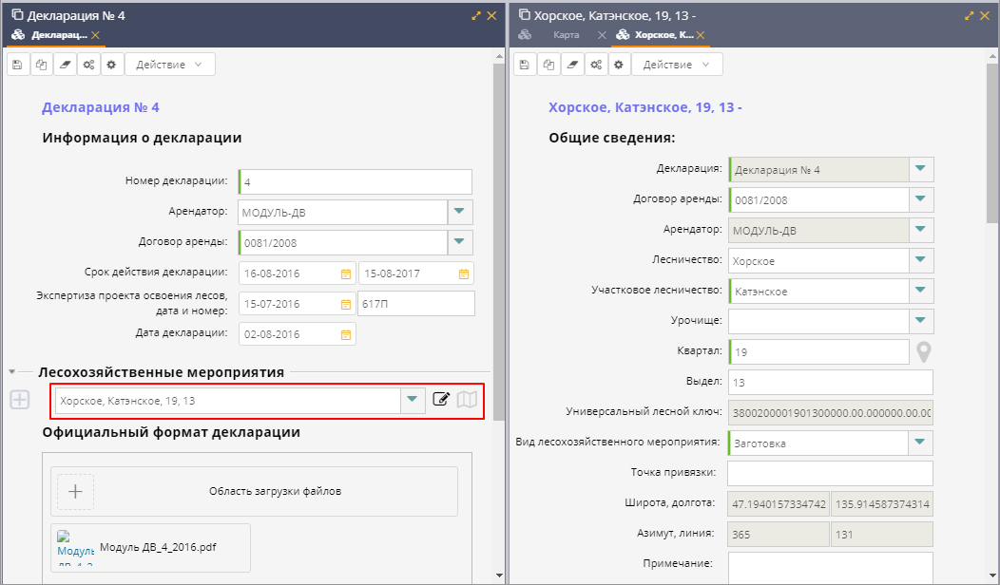
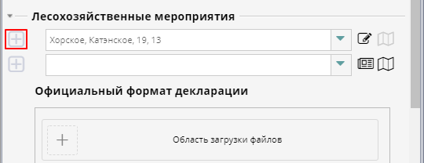
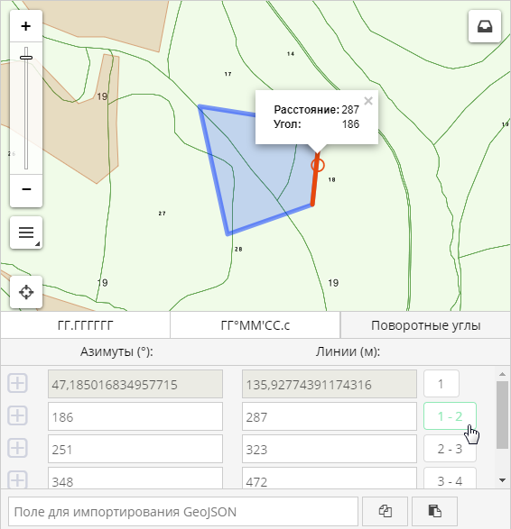

Назначение системы
==================

Система ввода лесных деклараций (далее – *Система*) разработана на базе платформы автоматизации «CITORUS» и предназначена для перевода лесных деклараций, предоставленных лесопользователями на бумажных носителях, в электронную форму.
 
Пользователями системы являются ГИС-специалисты органов исполнительной власти, исполняющих функции лесоуправления и ведения лесного реестра.

База лесных деклараций, создаваемая с помощью системы ввода лесных деклараций, предназначена для последующей эксплуатации в различных отраслевых информационных системах. 

Авторизация
===========

Работа с системой ввода лесных деклараций осуществляется с помощью программы-браузера. Для доступа к системе необходимо наличие подключения к сети Интернет.

Чтобы выполнить вход в систему, следует открыть браузер и ввести в адресную строку ссылку на требуемую инсталляцию системы. Откроется страница авторизации (рис. 1).

В полях **Логин** и **Пароль** следует указать соответствующие данные учетной записи и нажать на кнопку **Войти в систему**.
 

           
           Рисунок 1 – Страница авторизации

Интерфейс
=========

При входе в систему на экране отображается главное окно системы (рис. 2), в котором расположены:

1. Панель быстрого доступа к функциональности системы.
2. Форма ввода данных (на языке системы – *карточка*) лесной декларации.
3. Карта.

           
           Рисунок 2 – Главное окно системы

В разделах ниже представлено описание данных элементов интерфейса.

Панель быстрого доступа
-----------------------

Панель быстрого доступа к функциональности системы (рис. 3) содержит кнопки перехода к основным окнам/формам ввода данных, которые используются при работе с системой:

-  |image1| **Создать** – открыть карточку создания лесной декларации (работа с карточкой лесной декларации описана в разделе `Заполнение карточки лесной декларации`_).
-  |image2| **Таблицы** – открыть таблицу управления лесными декларациями или лесохозяйственными мероприятиями (работа с таблицами описана в разделе `Управление лесными декларациями`_).
-  |image3| **Карта** – открыть карту (описание карты представлено в разделе `Карта`_).
 

           
           Рисунок 3 – Панель быстрого доступа к функциональности системы
		   
Формы ввода данных
------------------

Для ввода данных, которые содержатся в лесных декларациях, предоставленных заказчиком в бумажном виде, в системе используются следующие формы ввода (на языке системы – *карточки*):

-  Карточка лесной декларации (работа с карточкой лесной декларации описана в разделе `Заполнение карточки лесной декларации`).
-  Карточка лесохозяйственного мероприятия (работа с карточкой лесохозяйственного мероприятия описана в разделе `Заполнение карточки лесохозяйственного мероприятия`_).

Карта
-----

Карта (рис. 4) предназначена для поиска, просмотра и отрисовки участков лесохозяйственных мероприятий.

По умолчанию карта открывается при входе в систему (рис. 2).

Также карту можно открыть следующими способами:

1. С помощью кнопки **Таблицы** |image2|, которая расположена на панели быстрого доступа к функциональности системы (рис. 3).
2. С помощью командной кнопки **Показать на карте**, которая расположена в таблице лесных деклараций и в таблице лесохозяйственных мероприятий (см. раздел `Таблицы`_).
 

           
           Рисунок 4 – Инструменты работы с картой
		   
Изменение масштаба карты выполняется стандартными способами, которые используются при работе с географическими информационными системами. Например:

1. Прокруткой колесика мыши: прокручивание от себя увеличивает масштаб, на себя – уменьшает.
2. С помощью масштабной линейки, которая расположена в левой части карты: нажатие на кнопку |image4| или перемещение бегунка вверх увеличивает масштаб, нажатие кнопки |image5| и перемещение бегунка вниз уменьшает масштаб.

Текущий масштаб карты отображается в левом нижнем углу.

Для перемещения по карте можно использовать клавиши клавиатуры, на которых изображены стрелки, указывающие вверх, вниз, влево и вправо. Кроме того, перемещаться по карте можно, удерживая левую клавишу мыши.

Для работы с картой предназначены следующие инструменты (рис. 4):

1. Меню управления геоподосновами.
2. Меню управления слоями.
3. Визуальный редактор.

Меню управления геоподосновами
^^^^^^^^^^^^^^^^^^^^^^^^^^^^^^

Меню управления геоподосновами (рис. 5) разворачивается при наведении курсора мыши на кнопку, представленную на рисунке 4 под цифрой 1.

Геоподосновы – это картографические поверхности, которые служат фоном для слоев. Для выбора какой-либо геоподосновы следует щелкнуть по ней мышью.
 

           
           Рисунок 5 – Меню управления геоподосновами

Меню управления слоями
^^^^^^^^^^^^^^^^^^^^^^

Меню управления слоями разворачивается при нажатии на кнопку, представленную на рисунке 6.
 
.. figure:: _static/interfeis_6.png
           :scale: 100 %
           :align: center        
           
           Рисунок 6 – Кнопка перехода в меню управления слоями
		   
Данное меню содержит следующие инструменты (рис. 7):

-  **Поиск по координатам** (рис. 7, цифра 1) – группа полей позволяет выполнить быстрый переход в требуемую точку на карте. Географические координаты точки можно указать в градусах в виде десятичной дроби (разделитель – запятая) или в градусах, минутах и секундах. Переход между полями, которые предназначены для ввода координат в различных форматах, осуществляется при нажатии на кнопки переключателя **Dec** и **Град**. Для перемещения в точку с указанными координатами следует нажать на кнопку |image7|, которая расположена под полями ввода координат.
-  **Поиск по территориальному объекту** (рис. 7, цифра 2) – группа полей позволяет выполнить быстрый переход к требуемому территориальному объекту. Для поиска указанного территориального объекта следует нажать на кнопку |image7|, которая расположена под полями поиска.
-  **Сохранить настройки карты** – при нажатии на данную кнопку система запоминает текущую конфигурацию карты: фокус карты, включенный слой и выбранную геоподоснову – и воспроизводит ее при повторном открытии карты.
-  |image6| – координаты точки, на которую указывает курсор на карте.
-  **Текущий масштаб** – текущий масштаб слоя.
-  **Доступные слои** – в списке отображаются слои карты, которые доступны текущему пользователю. Чтобы включить/отключить какой-либо слой или группу слоев на карте, следует поставить/снять флажок, соответствующий данному слою или группе слоев.
 

           
           Рисунок 7 – Меню управления слоями
		   
Визуальный редактор
^^^^^^^^^^^^^^^^^^^

Инструменты визуального редактора отображаются при нажатии на кнопку |image8| (рис. 8).

С помощью инструментов визуального редактора можно выполнить следующие действия:
-  |image9| – отобразить на карте координатную сетку.
-  |image10| – измерить расстояние от одной точки до другой линейкой.
-  Нарисовать участок лесохозяйственного мероприятия в виде полигона |image11| или линии |image12| и создать карточку данного лесохозяйственного мероприятия. Пример отрисовки участка представлен в разделе `Отрисовка участка на карте`_.
-  |image13| – редактировать фигуру участка.

Включение того или иного инструмента осуществляется нажатием на соответствующую ему кнопку, выключение инструмента – повторным нажатием на соответствующую кнопку.
 

           
           Рисунок 8 – Инструменты визуального редактора

Печать карты
^^^^^^^^^^^^

Чтобы распечатать текущий фрагмент карты, нажмите на кнопку |image14|, которая расположена под кнопкой перехода к инструментам визуального редактора (рис. 8).

В текущей вкладке браузера будет сформирована страница печати (пример представлен на рисунке 9):

-  В заголовке страницы печати отображается текущая дата и время.
-  В центральной части страницы – текущий фрагмент карты.
-  В нижней части страницы – кнопка для печати и кнопка для выхода из режима печати карты.
 

           
           Рисунок 9 – Страница печати
		   
Таблицы
-------

Управление лесными декларациями и лесохозяйственными мероприятиями, созданными в системе, осуществляется с помощью следующих таблиц:

-  Таблицы лесных деклараций (см. раздел `Табличный просмотр лесных деклараций`_). Пример таблицы лесных деклараций представлен на рисунке 10.
-  Таблицы лесохозяйственных мероприятий (см. раздел `Табличный просмотр лесохозяйственных мероприятий`_).

Переход к таблицам осуществляется с помощью панели быстрого доступа к функциональности системы (см. раздел `Панель быстрого доступа`_).
 

           
           Рисунок 10 – Таблица лесных деклараций

Основные данные системы
=======================

Лесные декларации
-----------------

Лесные декларации предоставляются лесопользователями в печатном виде. Данные, которые содержатся в лесных декларациях, переносятся в систему ГИС-специалистами.

Для создания лесных деклараций в системе используются формы ввода данных, которые называются *карточками лесных деклараций* (работа с карточками лесных деклараций описана в разделе `Заполнение карточки лесной декларации`_). Управление лесными декларациями, которые содержатся в системе, осуществляется с помощью таблицы лесных деклараций (см. раздел `Табличный просмотр лесных деклараций`_).

Лесохозяйственные мероприятия
-----------------------------

В каждой Лесной декларации, в Приложениях № 1 и № 4, содержится информация о лесохозяйственных мероприятиях, которые осуществляются лесопользователем согласно данной Лесной декларации.

В процессе ввода в систему данных о лесохозяйственных мероприятиях ГИС-специалисты выполняют следующие действия:

-  Создают карточки лесохозяйственных мероприятий (работа с карточками лесохозяйственных мероприятий описана в разделе `Заполнение карточки лесохозяйственного мероприятия`_).
-  Отрисовывают на карте участки лесохозяйственных мероприятий (работа с участками лесохозяйственных мероприятий описана в разделах `Отрисовка участка`_ и `Отрисовка участка на карте`_).

Управление лесохозяйственными мероприятиями, которые содержатся в системе, осуществляется с помощью таблицы лесохозяйственных мероприятий (см. раздел `Табличный просмотр лесохозяйственных мероприятий`_). Просмотр участков лесохозяйственных мероприятий осуществляется с помощью карты (см. раздел `Карта`_).

Порядок размещения данных о лесных декларациях
==============================================

Заполнение карточки лесной декларации
-------------------------------------

Карточка создания лесной декларации (рис. 11) по умолчанию открывается при входе в систему.
 

           
           Рисунок 11 – Карточка создания лесной декларации
		   
Также карточку создания лесной декларации можно открыть следующими способами:

1. С помощью панели быстрого доступа к функциональности системы (рис. 12). Для этого следует нажать на кнопку |image1| и в выпадающем меню нажать на ссылку **Лесная декларация**.
2. С помощью командной кнопки **Создать**, которая расположена в таблице деклараций (см. раздел `Табличный просмотр лесных деклараций`_).
 

           
           Рисунок 12 – Переход в карточку создания лесной декларации
		   
При работе с карточкой лесной декларации необходимо выполнить следующие действия:

1. Заполнить поля, расположенные в блоке **Информация о декларации** (рис. 13, цифра 1). В эти поля следует перенести данные, которые содержатся в лесной декларации, предоставленной арендатором в бумажном виде.
2. Прикрепить к карточке скан-копию лесной декларации. Загрузка документа осуществляется с помощью инструментов, расположенных в блоке **Официальный формат декларации** (рис. 13, цифра 2).
 

           
           Рисунок 13 – Блоки инструментов 

Ввод общей информации
^^^^^^^^^^^^^^^^^^^^^

В поля для ввода общей информации (рис. 13, цифра 1) внесите следующие данные из печатной формы лесной декларации (рис. 14):

-  **Номер декларации** – номер, который указан в заголовке лесной декларации.
-  **Арендатор** – название кампании-арендатора лесного участка (в примере, приведенном на рисунке 14, это *ООО «Модуль ДВ»*). В поле **Арендатор** работает контекстный поиск: при вводе части названия требуемой компании-арендатора автоматически разворачивается выпадающий список, в котором перечислены названия кампаний, подходящих под условия поиска.
-  **Договор аренды** – номер договора аренды лесного участка (в примере, приведенном на рисунке 14, это *0081/2008*). Номер договора аренды можно ввести вручную или выбрать из выпадающего списка, который разворачивается при нажатии на кнопку |image15|. При этом, если поле **Арендатор** заполнено (см. выше), то в выпадающем списке отображаются только номера договоров аренды, которые оформлены на указанного арендатора.
 

           
           Рисунок 14 – Лесная декларация

-  **Срок действия декларации** – в данной паре полей укажите дату начала и дату окончания действия декларации (в примере, приведенном на рисунке 15, дата начала – *16 августа 2016 г.*, дата окончания – *15 августа 2017 г.*). Выбор даты осуществляется с помощью календаря, который открывается при щелчке левой клавишей мыши по полю ввода даты.
-  **Экспертиза проекта освоения лесов, дата и номер** – в поле слева укажите дату приказа, согласно которому был утвержден проект освоения лесов (в примере, приведенном на рисунке 15, это *15 июля 2016 г.*). Выбор даты осуществляется с помощью календаря, который открывается при щелчке левой клавишей мыши по данному полю. В поле справа укажите номер приказа, согласно которому был утвержден проект освоения лесов (в примере, приведенном на рисунке 15, это *617П*). Номер приказа указывается вручную.
-  **Дата декларации** – укажите дату принятия лесной декларации, которая расположена под заголовком лесной декларации (в примере, приведенном на рисунке 14, это *02 августа 2016 г.*).
 

           
           Рисунок 15 – Лесная декларация

Загрузка скан-копии
^^^^^^^^^^^^^^^^^^^

Чтобы приложить к карточке лесной декларации отсканированную копию оригинального документа, в блоке **Официальный формат декларации** щелкните мышью по **Области загрузки файлов** (рис. 16).
 

           
           Рисунок 16 – Блок инструментов **Официальный формат декларации**
		   
В открывшемся проводнике Windows укажите расположение файла скан-копии и нажмите на кнопку **Открыть**.

Скан-копия загрузится в карточку лесной декларации (рис. 17).

При необходимости аналогичным образом в карточку лесной декларации можно загрузить другие документы.
 
.. figure:: _static/zapolnenie_kartochki_ld_11.png
           :scale: 100 %
           :align: center        
           
           Рисунок 17 – Скан-копия прикреплена

Чтобы сохранить карточку лесной декларации, на панели инструментов карточки нажмите на кнопку |image16| (рис. 16).

Декларация будет сохранена в БД под номером, указанным в блоке **Информация о декларации**, в поле **Номер декларации** (рис. 16).

Заполнение карточки лесохозяйственного мероприятия
---------------------------------------------------

Лесохозяйственное мероприятие можно создать в системе одним из следующих способов:

1. С помощью карточки лесохозяйственного мероприятия.
2. С помощью карты.

Создание лесохозяйственного мероприятия с помощью карточки
^^^^^^^^^^^^^^^^^^^^^^^^^^^^^^^^^^^^^^^^^^^^^^^^^^^^^^^^^^

Переход в карточку создания лесохозяйственного мероприятия осуществляется из карточки лесной декларации, в рамках которой выполняется данное лесохозяйственное мероприятие.

Чтобы открыть карточку требуемой лесной декларации, на панели быстрого доступа к функциональности системы нажмите на кнопку **Таблицы** |image2| и в выпадающем меню выберите пункт **Лесные декларации** (рис. 18).
 

           
           Рисунок 18 – Панель быстрого доступа к функциональности

В таблице деклараций выполните поиск требуемой декларации, затем отметьте ее в списке флажком (рис. 19, цифра 1) и нажмите на командную кнопку **Редактировать** (рис. 19, цифра 2) (подробнее см. в разделе `Табличный просмотр лесных деклараций`_).

Карточка лесной декларации откроется в левой части главного окна (рис. 19, цифра 3).
 

           
           Рисунок 19 – Поиск лесной декларации

Для перехода в карточку создания лесохозяйственного мероприятия нажмите на кнопку |image17|, которая расположена в карточке лесной декларации, в области **Лесохозяйственные мероприятия** (рис. 20, цифра 1).

Карточка лесохозяйственного мероприятия откроется в правой части окна (рис. 20, цифра 2).

Из карточки лесной декларации в карточку лесохозяйственного мероприятия, в блок полей **Общие сведения** автоматически переносятся следующие данные:

-  В поле **Декларация** копируется номер лесной декларации.
-  В поле **Договор аренды** копируется номер договора аренды лесного участка.
-  В поле **Арендатор** копируется название компании-арендатора лесного участка.
 

           
           Рисунок 20 – Карточка лесохозяйственного мероприятия

При заполнении карточки лесохозяйственного мероприятия следует выполнить следующие действия:

1. Заполнить поля, предназначенные для описания территории лесохозяйственного мероприятия.
2. Отрисовать участок лесохозяйственного мероприятия на карте, которая содержится в карточке лесохозяйственного мероприятия.
3. Заполнить поля, предназначенные для подробного описания лесохозяйственного мероприятия.
4. Сохранить карточку.

Описание территории лесохозяйственного мероприятия
""""""""""""""""""""""""""""""""""""""""""""""""""
Чтобы описать территорию лесохозяйственного мероприятия, откройте Приложение № 1 печатной формы лесной декларации. Из столбцов таблицы, которые отмечены на рисунке 21, перенесите данные в карточку лесохозяйственного мероприятия, в соответствующие поля блока **Общие сведения** (рис. 20):

-  Лесничество,
-  Участковое лесничество,
-  Урочище,
-  Квартал,
-  Выдел.
 
.. figure:: _static/zapolnenie_kartochki_lm_2.png
           :scale: 100 %
           :align: center        
           
           Рисунок 21 – Приложение № 1 к Лесной декларации

Отрисовка участка
"""""""""""""""""

Чтобы отрисовать на карте участок лесохозяйственного мероприятия, нажмите на кнопку |image18|, которая расположена справа от поля **Квартал** (рис. 22, цифра 1).
 

           
           Рисунок 22 – Установка маркера на карте

На карте, которая расположена в карточке лесохозяйственного мероприятия, установится маркер, указывающий местоположение участка (рис. 22, цифра 2). Местоположение участка рассчитывается автоматически на основе данных, указанных в полях **Лесничество**, **Участковое лесничество**, **Урочище**, **Квартал** и **Выдел**. В примере, приведенном на рисунке 22, маркер установлен в выделе № 13, который расположен в квартале № 19 Хорского лесничества.

Маркер обозначает начальную точку, от которой следует начинать отрисовку границ участка лесохозяйственного мероприятия. Геокоординаты точки, на которой установлен маркер, отображаются в области ввода координат объекта (рис. 23).
 

           
           Рисунок 23 – Область ввода координат объекта

Область ввода координат объекта содержит три вкладки, в которых географические координаты участка динамически пересчитываются в трех форматах:

-  Во вкладке **ГГ.ГГГГГГ** – в градусах в виде десятичной дроби (разделитель – запятая). Данная вкладка выбрана по умолчанию.
-  Во вкладке **ГГºММ’СС.с** – в градусах, минутах и секундах.
-  Во вкладке **Поворотные углы** – в азимутах и длинах линий между крайними точками участка. Геокоордината первой точки участка представлена в виде десятичной дроби, аналогично геокоординатам во вкладке **ГГ.ГГГГГГ**, и является нередактируемой.

Ввод геокоординат точек участка можно выполнить в любой из вкладок.

Рассмотрим ввод координат на примере вкладки **Поворотные углы**, так как описание точек участка в лесных декларациях представлено в виде азимутов и длин линий. Описание точек содержится в Приложении № 4 к Лесной декларации (рис. 24).
 

           
           Рисунок 24 – Приложение № 4 к Лесной декларации

Так как точка, которая устанавливается автоматически в карточке лесохозяйственного мероприятия, обозначает местоположение указанного выдела, ее координаты могут не совпадать с координатами первой точки участка, указанными в Приложении № 4. В этом случае положение данной точки рекомендуется отредактировать вручную.

Для этого нажмите на кнопку **Свернуть\Развернуть** |image19|, которая расположена в левой части карты (рис. 25). Поверх карты отобразятся инструменты визуального редактора.

Чтобы передвинуть точку, нажмите на кнопку **Редактировать слой** |image20|.
 

           
           Рисунок 25 – Инструменты визуального редактора

Переместите маркер в требуемое место карты, удерживая левую клавишу мыши. Затем нажмите на кнопку **Сохранить**, которая расположена под кнопкой **Редактировать слой** |image20| (рис. 26).
 

           
           Рисунок 26 – Изменение местоположения маркера

Чтобы добавить на карту вторую точку участка, откройте вкладку **Поворотные углы** и нажмите *левой* клавишей мыши на кнопку |image21|, которая расположена слева от первой точки участка, или нажмите *правой* клавишей мыши на кнопку  |image21|, которая расположена слева от первой точки участка, и выполните команду контекстного меню **Создать новый** или **Клонировать** (рис. 27).
 

           
           Рисунок 27 – Контекстное меню

В область ввода координат добавится пара полей для указания азимута и длины линии между первой и второй точкой участка (рис. 28). Укажите в этих полях соответствующие данные из второй строки таблицы Приложения № 4 (рис. 24).

На карте автоматически установится вторая точка и отрисуется указанная линия.
 

           
           Рисунок 28 – Ввод азимута и длины линии между первой и второй точкой

Аналогичным образом добавьте в область ввода координат все линии, которые содержатся в таблице Приложения № 4.

При вводе азимутов и длин линий можно также использовать следующие команды контекстного меню (рис. 29):

-  **Поднять наверх** – разместить пару полей, для которой выполняется команда, над предыдущей парой полей.
-  **Опустить вниз** – разместить пару полей, для которой выполняется команда, после нижестоящей пары полей.
-  **Удалить** – удалить пару полей.
 

           
           Рисунок 29 – Контекстное меню

Чтобы соединить первую и последнюю линию в первой точке, нажмите на кнопку **Замкнуть полигон** |image22| (рис. 30).
 

           
           Рисунок 30 – Кнопка **Замкнуть полигон**

В диалоговом окне, представленном на рисунке 31, нажмите на кнопку **Да**, если последнюю линию требуется соединить с первой точкой фигуры, или нажмите **Нет**, если между последней линией и первой точкой следует добавить дополнительную линию.

Точки фигуры замкнутся указанным способом.
 

           
           Рисунок 31 – Диалоговое окно
		   
Ввод подробной информации о лесохозяйственном мероприятии
"""""""""""""""""""""""""""""""""""""""""""""""""""""""""

Чтобы указать подробную информацию о лесохозяйственном мероприятии, в поле **Вид лесохозяйственного мероприятия** (рис. 32) укажите, какие действия будут выполняться на обозначенном участке: **Заготовка** (древесины) или **Прочее**. Вид использования лесов обозначен в заголовке Приложения № 1 к Лесной декларации (рис. 34).

Предположим, что в поле **Вид лесохозяйственного мероприятия** выбрана **Заготовка** (древесины). В этом случае в карточке отобразятся группы полей, представленные на рисунке 32.

.. note:: Если в поле **Вид лесохозяйственного мероприятия** выбрано значение **Прочее**, то в карточке отображаются группы полей, состав которых незначительно отличается от приведенных на рисунке 32. Заполнение данных групп полей выполняется аналогичным образом.
 

           
           Рисунок 32 – Поля для описания процесса заготовки древесины

В группе полей **Заготовка древесины (объемы использования)** (рис. 33) укажите данные из столбцов таблицы, которая содержится в Приложении № 1 к Лесной декларации (рис. 34). Наименования полей (сверху вниз на рис. 33) соответствуют наименованиям столбцов (от 1 до 7 на рис. 34).
 
.. figure:: _static/zapolnenie_kartochki_lm_5.png
           :scale: 100 %
           :align: center        
           
           Рисунок 33 – Группа полей **Заготовка древесины (объемы использования)**

.. note:: Поле **Категория защитных лесов** доступно для заполнения, если в поле **Целевое назначение лесов** указано назначение *Защитные*.
 

           
           Рисунок 34 – Данные для заполнения группы полей **Заготовка древесины (объем использования)**

Группа полей **Порода и объем заготовки** (рис. 35) предназначена для указания породы вырубаемой древесины и объема заготовки каждой породы в кубометрах.
 

           
           Рисунок 35 – Группа полей **Порода и объем заготовки**

Эти данные содержатся в столбцах таблицы, отмеченных на рисунке 36.
 

           
           Рисунок 36 – Данные для заполнения группы полей **Порода и объем заготовки**

По умолчанию в группе полей **Порода и объем заготовки** (рис. 35) содержится только одна пара полей. Заполните данные поля:

-  В поле **Порода** выберите из выпадающего списка породу вырубаемой древесины, которая приведена в первой строке на рисунке 36.
-  В поле **м3** укажите объем данной породы, предназначенный под вырубку.

Затем добавьте идентичную пару полей. Для этого нажмите *левой* клавишей мыши на кнопку |image21|, которая расположена справа от первой пары полей, или нажмите *правой* клавишей мыши на кнопку |image21|, которая расположена справа от первой пары полей, и выполните команду контекстного меню **Создать новый** (рис. 37).

Добавьте в карточку столько пар полей, сколько содержится в столбцах, отмеченных на рисунке 36. Заполните эти пары полей данными из таблицы.

Для управления парами полей предназначены также следующие команды контекстного меню (рис. 37):

-  **Поднять наверх** – разместить пару полей, для которой выполняется команда, над предыдущей парой полей.
-  **Опустить вниз** – разместить пару полей, для которой выполняется команда, после нижестоящей пары полей.
-  **Клонировать** – создать новую пару полей и заполнить ее идентичными данными.
-  **Удалить** – удалить пару полей.
 

           
           Рисунок 37 – Контекстное меню

В группе полей **Заготовка древесины (инфраструктура)** (рис. 38) укажите данные, которые содержатся в Приложении № 1, в таблице **Создание (снос) объектов лесной инфраструктуры** (рис. 39).
 

           
           Рисунок 38 – Группа полей **Заготовка древесины (инфраструктура)**

Поля группы (сверху вниз на рис. 38) соответствуют столбцам, отмеченным на рисунке 39 цифрами от 1 до 7.
 

           
           Рисунок 39 – Данные для заполнения группы полей **Заготовка древесины (инфраструктура)**

В группе полей **Порода и объем заготовки (инфраструктура)** (рис. 40) укажите перечень пород, которые подлежат вырубке в ходе создания (сноса) объектов лесной инфраструктуры, и объем данных пород в кубометрах. Соответствующие данные содержатся в столбцах таблицы **Создание (снос) объектов лесной инфраструктуры**, отмеченных на рисунке 41.
 

           
           Рисунок 40 – Группа полей **Порода и объем заготовки (инфраструктура)**

Заполнение группы полей **Порода и объем заготовки (инфраструктура)** осуществляется аналогично заполнению группы полей **Порода и объем заготовки** (порядок действий см. в данном разделе выше).
 

           
           Рисунок 41 – Данные для заполнения группы полей **Порода и объем заготовки (инфраструктура)**

Сохранение карточки лесохозяйственного мероприятия
""""""""""""""""""""""""""""""""""""""""""""""""""

Чтобы сохранить карточку лесохозяйственного мероприятия, на панели инструментов карточки нажмите на кнопку |image16| (рис. 42).
 
.. figure:: _static/zapolnenie_kartochki_lm_25.png
           :scale: 100 %
           :align: center        
           
           Рисунок 42 – Сохранение карточки

После сохранения в карточке автоматически заполняются следующие поля (рис. 43):

-  **Универсальный лесной ключ**.
-  **Точка привязки**.
-  **Широта, долгота** – географические координаты первой точки участка в градусах в виде десятичной дроби.
-  **Азимут, линия** – азимут и длина линии между первой и второй точками участка.
 

           
           Рисунок 43 – Автоматически заполненные поля

Сохраненная карточка лесохозяйственного мероприятия прикрепляется к карточке лесной декларации (рис. 44).
 

           
           Рисунок 44 – Привязка карточки лесного мероприятия к карточке лесной декларации

Если к лесной декларации требуется прикрепить еще одно лесохозяйственное мероприятие, то в карточке лесной декларации следует нажать на кнопку |image21|, которая расположена слева от поля с данными о первом лесохозяйственном мероприятии (рис. 45).

Ниже добавится поле для создания нового лесохозяйственного мероприятия. Для создания лесохозяйственного мероприятия выполните действия, описанные в разделе `Создание лесохозяйственного мероприятия с помощью карточки`_ или `Создание лесохозяйственного мероприятия с помощью карты`_.

Аналогичным образом к карточке лесной декларации можно прикрепить любое количество лесохозяйственных мероприятий.
 

           
           Рисунок 45 – Добавление поля для создания нового лесохозяйственного мероприятия

Создание лесохозяйственного мероприятия с помощью карты
^^^^^^^^^^^^^^^^^^^^^^^^^^^^^^^^^^^^^^^^^^^^^^^^^^^^^^^

Чтобы создать лесохозяйственное мероприятие с помощью карты, необходимо выполнить следующие шаги:

1. Вручную нарисовать на карте, которая отображается в правой части главного окна, участок лесохозяйственного мероприятия.
2. В карточке лесохозяйственного мероприятия описать территорию участка и заполнить поля с подробным описанием лесохозяйственного мероприятия.
3. Сохранить карточку лесохозяйственного мероприятия.

Отрисовка участка на карте
""""""""""""""""""""""""""

Любое лесохозяйственное мероприятие, которое создается в системе, должно быть привязано к соответствующей лесной декларации. В связи с этим для создания лесохозяйственного мероприятия необходимо открыть карточку лесной декларации, в рамках которой выполняется данное лесохозяйственное мероприятие.

Чтобы открыть карточку требуемой лесной декларации, на панели быстрого доступа к функциональности системы нажмите на кнопку **Таблицы** |image2| и в выпадающем меню выберите пункт **Лесные декларации** (рис. 46).
 

           
           Рисунок 46 – Панель быстрого доступа к функциональности

В таблице деклараций выполните поиск требуемой декларации, затем отметьте ее в списке флажком (рис. 47, цифра 1) и нажмите на командную кнопку **Редактировать** (рис. 47, цифра 2) (подробнее см. в разделе `Табличный просмотр лесных деклараций`_).

Карточка лесной декларации откроется в левой части главного окна (рис. 47, цифра 3).
 

           
           Рисунок 47 – Поиск лесной декларации

В карточке лесной декларации нажмите на кнопку |image23|, которая расположена в блоке **Лесохозяйственные мероприятия** (рис. 48, цифра 1).

На карте, расположенной в правой части главного окна, отобразятся инструменты визуального редактора. Данные инструменты предназначены для отрисовывания участка лесохозяйственного мероприятия.

Установите фокус карты на территории, на которой расположен участок. Для этого нажмите на кнопку, отмеченную цифрой 2 на рисунке 48.
 

           
           Рисунок 48 – Создание лесохозяйственного мероприятия с помощью карты

Откроется меню управления слоями (рис. 49).
 

           
           Рисунок 49 – Меню управления слоями

Заполните в данном меню следующие поля:

-  **Край** – укажите субъект Российской Федерации, в котором расположен участок лесохозяйственного мероприятия: *Хабаровский край* или *Приморский край*. Субъект РФ указан в Лесной декларации (пример см. на рис. 50).
 

           
           Рисунок 50 – Лесная декларация

-  **Лесничество**, **Участковое лесничество** и **Квартал** – соответствующие данные о местоположении участка содержатся в Приложении № 1 к Лесной декларации (см. рис. 51).
 

           
           Рисунок 51 – Приложение № 1 к Лесной декларации

Затем нажмите на кнопку |image7|, которая расположена под данными полями.

Указанный квартал будет отмечен на карте маркером (рис. 52).
 

           
           Рисунок 52 – Маркер
		   
Чтобы начать отрисовку участка, в визуальном редакторе нажмите на кнопку **Нарисовать полигон** |image11| (рис. 53).

Затем щелчками левой клавиши мыши по карте обозначьте крайние точки участка. Чтобы замкнуть фигуру, повторно нажмите на точку участка, которая была установлена первой.
 

           
           Рисунок 53 – Отрисовка участка

Создание карточки лесохозяйственного мероприятия
""""""""""""""""""""""""""""""""""""""""""""""""

Чтобы создать карточку лесохозяйственного мероприятия, во всплывающем окне, которое отображается над участком, нажмите на ссылку **Лесохозяйственное мероприятие** (рис. 54).
 

           
           Рисунок 54 – Всплывающее окно

Карточка лесохозяйственного мероприятия откроется в новой вкладке (рис. 55).
 

           
           Рисунок 55 – Карточка лесохозяйственного мероприятия

В карточке лесохозяйственного мероприятия, в области **Проверка угловых** точек отобразится участок лесохозяйственного мероприятия, отрисованный ранее на карте, и геокоординаты данного участка.

Геокоординаты участка отображаются в следующих форматах:

-  Во вкладке **ГГ.ГГГГГГ** – в градусах в виде десятичной дроби (разделитель – запятая). Данная вкладка выбрана по умолчанию.
-  Во вкладке **ГГºММ’СС.с** – в градусах, минутах и секундах.
-  Во вкладке **Поворотные углы** – в азимутах и длинах линий между крайними точками участка. Геокоордината первой точки участка представлена в виде десятичной дроби, аналогично геокоординатам во вкладке **ГГ.ГГГГГГ**, и является нередактируемой.

При необходимости фигуру участка можно отредактировать следующими способами:

-  На карте, с помощью инструментов визуального редактора (рис. 56). При этом в области координат, во вкладках **ГГ.ГГГГГГ** и **ГГºММ’СС.с** будут соответствующим образом меняться координаты точек фигуры, а во вкладке **Поворотные углы** будут соответствующим образом меняться линии и азимуты.
-  В области координат (рис. 57), вручную добавляя и редактируя координаты точек/линии и азимуты фигуры. При этом на карте в реальном режиме времени фигура будет перемещаться и видоизменяться в соответствии с указанными данными.

Чтобы редактировать фигуру участка с помощью карты, в левой части карты нажмите на кнопку **Свернуть/Развернуть** |image8|. Поверх карты отобразятся инструменты визуального редактора (рис. 56).

Нажмите на кнопку |image13| и, перемещая крайние точки фигуры, придайте участку требуемую форму. Затем нажмите на кнопку **Сохранить**, которая расположена под кнопкой |image13|.
 

           
           Рисунок 56 – Редактирование границ участка

Чтобы редактировать участок с помощью области ввода координат объекта, выберите вкладку, в которой будет осуществляться добавление/редактирование геокоординат.

Если требуется добавить новую координату во вкладке **ГГ.ГГГГГГ** или **ГГºММ’СС.с**, воспользуйтесь одним из следующих способов:

1. Нажмите правой клавишей мыши на кнопку |image21|, которая расположена слева от требуемой координаты. Например, если новую точку следует добавить между первой и второй координатой, нажмите на кнопку |image21|, расположенную слева от первой координаты (рис. 57). Затем выполните одну из следующих команд контекстного меню:

      -  **Создать новый** – чтобы создать координату, в полях **Широта** и **Долгота** которой будут указаны градусы (целые числа до запятой) из выбранной координаты (рис. 58).
      -  **Клонировать** – чтобы создать координату, идентичную выбранной.

           
           Рисунок 57 – Добавление координаты

2. Нажмите левой клавишей мыши на кнопку |image21|, которая расположена слева от требуемой координаты. Ниже добавится новая координата, в полях **Широта** и **Долгота** которой будут указаны градусы (целые числа до запятой) из выбранной координаты (рис. 58).
 

           
           Рисунок 58 – Строка новой координаты

Если требуется добавить новую линию во вкладке **Поворотные углы**, воспользуйтесь одним из следующих способов:

1. Нажмите правой клавишей мыши на кнопку |image21|, которая расположена слева от первой линии (рис. 59). Затем выполните команду контекстного меню **Создать новый** или **Клонировать**.
 

           
           Рисунок 59 – Добавление линии

2. Нажмите левой клавишей мыши на кнопку |image21|, которая расположена слева от первой линии.

Ниже добавятся поля для создания новой линии (рис. 60). Укажите в поле **Линии (м)** длину линии, которую необходимо добавить, а в поле **Азимуты (°)** – угол поворота.

           
           Рисунок 60 – Поле для добавления новой линии

Если при работе во вкладках **ГГ.ГГГГГГ** и **ГГºММ’СС.с** следует выделить на карте какую-либо из точек фигуры, нажмите на кнопку, на которой обозначен порядковый номер данной точки (рис. 61).
 

           
           Рисунок 61 – Просмотр точки фигуры на карте

Если при работе во вкладке **Поворотные углы** требуется выделить на карте какую-либо из линий фигуры, нажмите на кнопку, на которой обозначены порядковые номера точек данной линии (рис. 62).
 

           
           Рисунок 62 – Просмотр линии фигуры на карте

Если какие-либо точки/линии фигуры следует поменять местами, используйте команды контекстного меню **Поднять наверх** и **Опустить вниз** (рис. 59).

Если требуется удалить какую-либо точку/линию фигуры, выполните для этой линии команду контекстного меню **Удалить**.

После того как редактирование фигуры участка будет завершено, укажите в карточке подробную информацию о лесохозяйственном мероприятии. Для этого выполните действия, описанные в разделах данного руководства `Описание территории лесохозяйственного мероприятия`_ и `Ввод подробной информации о лесохозяйственном мероприятии`_.

Сохранение карточки лесохозяйственного мероприятия
""""""""""""""""""""""""""""""""""""""""""""""""""

Для сохранения карточки лесохозяйственного мероприятия выполните действия, описанные в разделе `Создание лесохозяйственного мероприятия с помощью карточки`_, в подразделе `Сохранение карточки лесохозяйственного мероприятия`_.

Управление лесными декларациями
===============================

Табличный просмотр лесных деклараций
------------------------------------

Управление лесными декларациями, созданными в системе, осуществляется с помощью таблицы деклараций. Чтобы открыть данную таблицу, на панели быстрого доступа к функциональности нажмите на кнопку **Таблицы** |image2| и в выпадающем меню выберите пункт **Лесные декларации** (рис. 63).
 

           
           Рисунок 63 – Панель быстрого доступа к функциональности

Таблица деклараций содержит следующие инструменты управления:

1. Командные кнопки (рис. 64, цифра 1) – отображаются при наличии соответствующих прав (права выдаются администратором системы) и позволяют выполнять следующие действия:

      -  **Создать** – создать карточку новой лесной декларации.
      -  **Удалить** – удалить карточку лесной декларации, строка которой выделена в таблице.
      -  **Редактировать** – открыть карточку лесной декларации, выделенной в таблице, для редактирования данных.
      -  **Показать на карте** – при нажатии на данную кнопку в новой вкладке открывается карта, на которой отмечены все участки лесохозяйственных мероприятий, которые выполняются в соответствии с лесной декларацией, выделенной в таблице.
      -  **Экспорт в csv** – сохранить таблицу деклараций в файл в формате CSV. Файл загружается в папку, указанную в браузере для загрузки файлов по умолчанию.
	  
2. Фильтры для отбора данных (рис. 64, цифра 2) – по умолчанию в таблице отображаются все лесные декларации, которые содержатся в системе. Для отбора деклараций в заголовке каждого столбца расположен фильтр одного из следующих типов:

      -  **Выпадающий список** – предназначен для отбора деклараций по списку фиксированных значений. Например, по названию компании-арендатора, на которого оформлена данная декларация.
      -  **Строка ввода** – предназначена для поиска лесных деклараций по нефиксированным значениям. Например, по наименованию декларации.
      -  **Поле для выбора даты** – предназначено для отбора лесных деклараций по следующим датам: дате принятия декларации, дате начала действия декларации и дате окончания действия декларации.

Одновременно для поиска лесных деклараций можно использовать любое количество фильтров.
 

           
           Рисунок 64 – Таблица деклараций

В столбце таблицы **Лесохозяйственное мероприятие** перечислены все лесохозяйственные мероприятия, которые прикреплены к соответствующей лесной декларации. Если требуется открыть карточку какого-либо лесохозяйственного мероприятия, следует щелкнуть левой клавишей мыши по его наименованию. Карточка лесохозяйственного мероприятия откроется в новой вкладке.

В нижней части таблицы расположена информационная строка (рис. 64, цифра 3). В ней отображается общее количество лесных деклараций, которое содержится в таблице в настоящий момент.

Табличный просмотр лесохозяйственных мероприятий
------------------------------------------------

Управление лесохозяйственными мероприятиями, созданными в системе, осуществляется с помощью таблицы лесохозяйственных мероприятий. Чтобы открыть данную таблицу, на панели быстрого доступа к функциональности нажмите на кнопку **Таблицы** |image2| и в выпадающем меню выберите пункт **Лесохозяйственные мероприятия** (рис. 65).
 

           
           Рисунок 65 – Панель быстрого доступа к функциональности

Таблица лесохозяйственных мероприятий содержит следующие инструменты управления:

1. Командные кнопки (рис. 66, цифра 1) – отображаются при наличии соответствующих прав (права выдаются администратором системы) и позволяют выполнять следующие действия:

      -  **Удалить** – удалить карточку лесохозяйственного мероприятия, строка которого выделена в таблице.
      -  **Редактировать** – открыть карточку лесохозяйственного мероприятия, выделенного в таблице, для редактирования данных. Карточка лесохозяйственного мероприятия открывается в новой вкладке.
      -  **Показать на карте** – при нажатии на данную кнопку в новой вкладке открывается карта, на которой отмечен участок лесохозяйственного мероприятия, выделенного в таблице.
      -  **Экспорт в csv** – сохранить таблицу лесохозяйственных мероприятий в файл в формате CSV. Файл загружается в папку, указанную в браузере для загрузки файлов по умолчанию.
 

           
           Рисунок 66 – Талица лесных деклараций
		   
2. Фильтры для отбора данных (рис. 66, цифра 2) – по умолчанию в таблице отображаются все лесохозяйственные мероприятия, которые содержатся в системе. Для отбора лесохозяйственных мероприятий в заголовке каждого столбца расположен фильтр одного из следующих типов:

      -  **Выпадающий список** – предназначен для отбора лесохозяйственных мероприятий по списку фиксированных значений. Например, по наименованию лесничества.
      -  **Строка ввода** – предназначена для поиска лесохозяйственных мероприятий по нефиксированным значениям. Например, по номеру лесосеки.

Одновременно для поиска лесных деклараций можно использовать любое количество фильтров.

В столбце таблицы **Декларация** отображаются наименования деклараций, к которым прикреплены лесохозяйственные мероприятия. Если требуется открыть карточку какой-либо лесной декларации, следует щелкнуть левой клавишей мыши по ее наименованию. Карточка данной лесной декларации отобразится в левой части главного окна системы.

В нижней части таблицы расположена информационная строка (рис. 66, цифра 3). В ней отображается общее количество лесохозяйственных мероприятий, которое содержится в таблице в настоящий момент.

Журнал изменений
================

+-----------+--------------+-------------------------------------------------------------------------------------------------+
| Версия    | Дата         | Исправления                                                                                     |
+===========+==============+=================================================================================================+
| v.1.000   | 18.04.2018   | Размещение исходной версии документа.                                                           |
+-----------+--------------+-------------------------------------------------------------------------------------------------+

.. |image1| image:: https://github.com/citoruspm/svld/blob/master/source/_static/knopka_1.png
.. |image2| image:: https://github.com/citoruspm/svld/blob/master/source/_static/knopka_10.png
.. |image3| image:: https://github.com/citoruspm/svld/blob/master/source/_static/knopka_15.png
.. |image4| image:: https://github.com/citoruspm/svld/blob/master/source/_static/knopka_16.png
.. |image5| image:: https://github.com/citoruspm/svld/blob/master/source/_static/knopka_17.png
.. |image6| image:: https://github.com/citoruspm/svld/blob/master/source/_static/knopka_19.png
.. |image7| image:: https://github.com/citoruspm/svld/blob/master/source/_static/knopka_12.png
.. |image8| image:: https://github.com/citoruspm/svld/blob/master/source/_static/knopka_23.png
.. |image9| image:: https://github.com/citoruspm/svld/blob/master/source/_static/knopka_20.png
.. |image10| image:: https://github.com/citoruspm/svld/blob/master/source/_static/knopka_21.png
.. |image11| image:: https://github.com/citoruspm/svld/blob/master/source/_static/knopka_13.png
.. |image12| image:: https://github.com/citoruspm/svld/blob/master/source/_static/knopka_22.png
.. |image13| image:: https://github.com/citoruspm/svld/blob/master/source/_static/knopka_14.png
.. |image14| image:: https://github.com/citoruspm/svld/blob/master/source/_static/knopka_24.png
.. |image15| image:: https://github.com/citoruspm/svld/blob/master/source/_static/knopka_2.png
.. |image16| image:: https://github.com/citoruspm/svld/blob/master/source/_static/knopka_3.png
.. |image17| image:: https://github.com/citoruspm/svld/blob/master/source/_static/knopka_4.png
.. |image18| image:: https://github.com/citoruspm/svld/blob/master/source/_static/knopka_6.png
.. |image19| image:: https://github.com/citoruspm/svld/blob/master/source/_static/knopka_7.png
.. |image20| image:: https://github.com/citoruspm/svld/blob/master/source/_static/knopka_8.png
.. |image21| image:: https://github.com/citoruspm/svld/blob/master/source/_static/knopka_5.png
.. |image22| image:: https://github.com/citoruspm/svld/blob/master/source/_static/knopka_9.png
.. |image23| image:: https://github.com/citoruspm/svld/blob/master/source/_static/knopka_11.png
